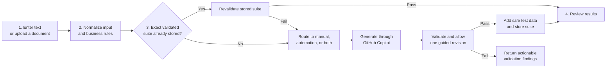
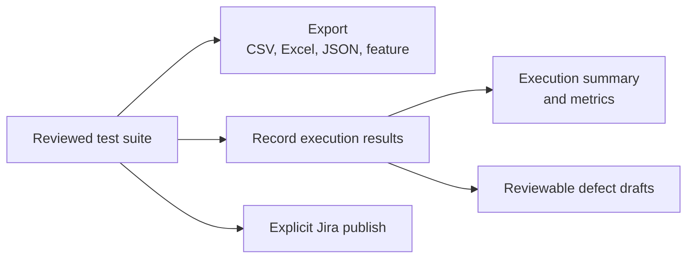
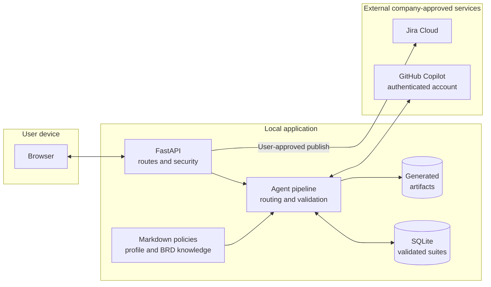
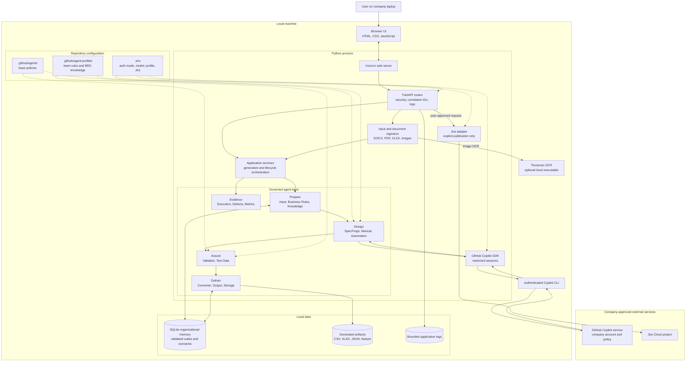

# Story-to-Tests AI Agent

A local web application that turns a user story, feature description, or acceptance criteria
into structured test cases. It classifies cases as critical, smoke, sanity, or regression,
generates safe synthetic test data, exports Xray-ready CSV/Excel/JSON through the Context
Converter Agent, and can attach the CSV to a Jira Cloud
story with a summary comment.

Requirements can be pasted or uploaded as Word (`.docx`), text PDF, Excel (`.xlsx`), Apple
Pages (`.pages`), Apple Numbers (`.numbers`), PNG, or JPEG. Pages/Numbers packages are read from
Quick Look previews or legacy XML when available; binary-only IWA packages must first be exported
from the Mac as PDF or XLSX. A document-ingestion component extracts normalized text, the requirement-to-test-case
agent generates the suite, and an independent validator reports coverage, traceability,
duplicates, clarity, and expected-result quality. Image extraction uses local Tesseract OCR.

The application uses fourteen discoverable agents across the test lifecycle. In addition to
requirement ingestion, manual/automation generation, validation, conversion, and storage, it can
normalize business rules, recall approved knowledge, fill privacy-safe test data, summarize test
execution, draft defects, and calculate quality metrics. `GET /api/agents` lists every agent's
responsibility, runtime, and capabilities. Only suites that pass independent validation are newly
stored for future exact-match reuse.

Agent behavior is defined in readable `.github/agents/*.agent.md` files. The FastAPI/Python layer
loads the relevant SpecForge, specialist, and quality-gate policies into each Copilot session and
retains deterministic enforcement for validation, conversion, storage, security, and the web UI.
Team and project customization is layered through `.github/agent-profiles/<profile>/`. Set
`AGENT_PROFILE` to select a profile; `profile.md` applies common rules and optional files named
after an agent add role-specific conventions. The base safety and quality policies cannot be
replaced by a profile.

The active default is `auto-finance-quotation`. Its `knowledge/quotation-brd-baseline.md` is the
reviewable BRD v1.0 knowledge source used by the agents. This is prompt-time grounded context, not
irreversible model fine-tuning; updating or reverting the Markdown changes the baseline cleanly.

At generation time, choose either manual test cases with numbered steps and expected results or BDD
scenarios written as `Scenario / Given / When / Then`. Both formats retain category, priority,
automation/manual feasibility, a decision rationale, test data, acceptance-criteria traceability,
and CSV/JSON/Jira export support.

BDD output is ready for SpecFlow feature files. Data-driven flows use `Scenario Outline` with
parameter placeholders and `Examples` tables where appropriate. The results screen can copy an
individual scenario or a complete feature containing all generated scenarios.

Before calling Copilot, the application checks a repository-local organizational memory at
`.agent-memory/test_suites.db`. An exact normalized match returns the previously validated suite
immediately and avoids a new premium request. New results are stored for subsequent reuse. The
database is local operational data and is excluded from source control.

For this proof of concept, generation returns 4–5 concise, high-level, non-duplicate risk
scenarios, including at least two automation and two manual cases, while keeping Copilot response
times practical. Before publishing, select individual cases
with the Jira checkboxes; only those cases are included in the Jira attachment and summary.

## Run locally

1. Install Python 3.11 or newer.
2. Create and activate a virtual environment:

   ```bash
   python3 -m venv .venv
   source .venv/bin/activate
   pip install -e '.[dev]'
   ```

3. Copy `.env.example` to `.env`.
4. Ensure GitHub Copilot CLI is installed, then authenticate it using your Copilot-enabled
   account:

   ```bash
   copilot login
   ```

   Your organization administrator must enable the Copilot CLI policy. For non-interactive
   deployments, configure `COPILOT_GITHUB_TOKEN` instead.
5. Start the app:

   ```bash
   uvicorn app.main:app --reload
   ```

6. Open <http://127.0.0.1:8000>. API documentation is at `/docs`.

On Windows PowerShell, activate the environment with `.\.venv\Scripts\Activate.ps1`. If the
`uvicorn` command is not on `PATH`, use `python -m uvicorn app.main:app --reload` on any platform.

## Test lifecycle and API

The browser provides the main workflow. The HTTP API also exposes each governed lifecycle action
independently:

| Stage | Endpoint | What it does |
| --- | --- | --- |
| Inspect | `GET /api/health` | Shows service, Copilot authentication mode, model selection, profile, and memory status. |
| Discover | `GET /api/agents` | Lists registered agents, responsibilities, runtimes, and capabilities. |
| Observe | `GET /api/logs` | Returns bounded operational logs, optionally filtered by correlation ID. |
| Generate | `POST /api/generate` | Generates test cases directly from a validated JSON request. |
| Orchestrate | `POST /api/agent/run` | Runs the governed multi-agent generation and validation pipeline. |
| Upload | `POST /api/generate/document` | Extracts a supported document and generates a validated suite. |
| Expand | `POST /api/generate/expand` | Adds distinct risk-based coverage to an existing suite. |
| Cancel | `POST /api/generation/{request_id}/cancel` | Requests cancellation of an active generation. |
| Enrich | `POST /api/test-data` | Fills missing test data with case-aligned synthetic values. |
| Record | `POST /api/execution` | Validates execution results and calculates a pass-rate summary. |
| Triage | `POST /api/defects` | Creates human-review-required drafts for failed tests. |
| Measure | `POST /api/metrics` | Calculates coverage, execution, and defect metrics. |
| Convert | `POST /api/context-converter/{output_format}` | Converts a validated suite to CSV, Excel, JSON, or a feature file. |
| Export | `POST /api/export/csv` | Produces a CSV download. |
| Publish | `POST /api/jira/publish` | Attaches selected cases to Jira after an explicit user action. |

Execution results are supplied by an approved manual or automation source; this application does
not execute arbitrary test commands. Defects remain drafts until a person reviews them, and Jira
publication is never automatic.

## Engineering quality

The repository enforces a shared organizational baseline through executable checks:

```bash
make quality
```

This runs Ruff formatting/lint policy, MyPy type checks, tests with branch coverage, and Python
compilation. CI also audits installed dependencies for known vulnerabilities. The application
ships with JSON request logs, correlation IDs, baseline browser security headers, a non-root
container image, bounded document processing, sanitized provider errors, and an explicit
human-controlled Jira publication boundary.

## GitHub Copilot runtime

GitHub Copilot is the only AI runtime in this application. The official Python Copilot SDK
starts its bundled Copilot CLI runtime and uses either the locally signed-in GitHub identity or
`COPILOT_GITHUB_TOKEN`. The app does not support OpenAI keys, GitHub Models, Ollama, BYOK, mock
generation, or any other agent/provider.

Each generation prompt counts toward the Copilot usage allowance associated with the
authenticated identity. The browser requests 4–5 high-level scenarios in one prompt so a
failed follow-up cannot leave partial results. Leave `COPILOT_MODEL` blank to use the account
default, or set it to a
model allowed by your organization's Copilot policy. Never commit a token.

## Jira Cloud setup

Set `JIRA_BASE_URL`, `JIRA_EMAIL`, and `JIRA_API_TOKEN` in `.env`. The Jira user needs Browse
Projects, Add Attachments, and Add Comments permissions for the target project. The app uses
Jira Cloud REST API v3. Publishing is always initiated by the user and attaches a timestamped
CSV; it does not create or overwrite Jira issues.

For Jira Data Center or a test-management plugin such as Xray/Zephyr, implement a separate
adapter because their authentication and test-case APIs differ.

## Develop with GitHub Copilot

Open the folder in VS Code, install the GitHub Copilot and GitHub Copilot Chat extensions, and
sign in. Repository guidance is already provided in `.github/copilot-instructions.md`.

This repository also includes:

- `.github/agents/test-designer.agent.md`: a custom QA-focused Copilot agent.
- `.github/prompts/add-test-generation-feature.prompt.md`: a reusable agent-mode prompt.
- `.github/workflows/ci.yml`: GitHub Actions checks for every pull request and main-branch push.

In Copilot Chat, select the `test-designer` custom agent when designing or changing test-suite
behaviour. Use `/add-test-generation-feature` for implementation tasks where
prompt files are supported.

Useful Copilot Chat tasks:

- `Add unit tests for JiraClient using respx; cover attachment and comment failures.`
- `Add an editable review screen before publishing while preserving the TestSuite schema.`
- `Add an Xray Cloud publisher as a new adapter without changing JiraClient.`
- `Add Playwright end-to-end tests for generation, download, and validation errors.`

Always review generated code and test cases. The AI output is a draft, not evidence of coverage
or a substitute for security, accessibility, performance, and domain-expert testing.

## Architecture

The design is hybrid: GitHub Copilot proposes test content, while local Python code controls input
validation, routing, schema enforcement, quality gates, persistence, conversion, observability,
and external publication. Markdown files describe agent behavior and project knowledge, but they
cannot bypass these code-enforced boundaries.

### What happens when a user generates tests



The memory check can avoid a Copilot request for an exact known requirement. A stored suite is
still revalidated before use. For a new requirement, SpecForge selects the manual specialist, the
automation specialist, or both. Output that still fails after one findings-driven revision is not
stored or offered for publication.

After generation, a user can choose only the actions they need:



### Where each responsibility runs



Only generation crosses the GitHub Copilot boundary. Document processing, validation, synthetic
fallback data, execution summaries, defect drafts, metrics, storage, and exports run locally.
Jira is contacted only when a user explicitly publishes selected cases.

### Complete infrastructure view

This diagram combines the deployment boundaries and major runtime components. Solid arrows show
runtime calls or data movement; dotted arrows show configuration supplied to the pipeline.



The entire FastAPI application, deterministic agent logic, SQLite memory, generated files, and
logs stay on the local machine. Requirement content is sent to GitHub only when a Copilot-backed
generation is needed. Jira receives only the cases selected in an explicit publish request.

### Agent responsibilities

The fourteen roles are grouped below by purpose so their relationship is easier to scan:

| Group | Agents | Responsibility |
| --- | --- | --- |
| Prepare | Input, Business Rules, Knowledge | Extract and normalize requirements, bind `BR-*` rules, and recall exact validated suites. |
| Generate | SpecForge Router, Manual Generator, Automation Generator | Select the requested route and generate focused manual or repeatable automation scenarios. |
| Assure | Test Case Validator, Test Data | Enforce coverage and traceability rules and fill missing values with privacy-safe synthetic data. |
| Deliver | Context Converter, Output, Test Storage | Convert approved suites, retain artifacts, and store validated knowledge for exact-match reuse. |
| Learn from execution | Execution, Bug Reporter, Metrics | Validate supplied results, draft defects for review, and calculate transparent quality measures. |

Agent behavior lives in `.github/agents/*.agent.md`. Team-specific rules and version-controlled
knowledge are layered from `.github/agent-profiles/<profile>/`; the default profile is
`auto-finance-quotation`. This is prompt-time grounding, not model training.

### Code map

- `app/agents/`: typed capability contracts, declarative agent definitions, and the shared
  fail-closed Copilot runtime.
- `app/agents/runner.py`: the sole owner of Copilot SDK sessions, restricted options, timeouts,
  event handling, JSON extraction, and Pydantic structured-output validation.
- `app/agents/lifecycle_agents.py`: business-rule, knowledge, test-data, execution, defect, and metrics agents.
- `app/agents/test_case_validator.py`: independent deterministic test-suite validation agent.
- `app/services/`: application use-case orchestration, independent of HTTP transport.
- `app/services/document_ingestion.py`: bounded Word, PDF, Excel, and image text extraction.
- `app/dependencies.py`: composition root for the approved runtime and application services.
- `app/generator.py`: test-suite request/normalization logic using Markdown instructions and the
  shared structured-agent runtime.
- `app/models.py`: validated API and model-output contracts.
- `app/jira.py`: Jira Cloud attachment/comment integration.
- `app/exporter.py`: CSV export.
- `app/static/index.html`: dependency-free browser UI.
- `tests/`: fast local tests; external APIs should always be mocked.

See [architecture](docs/architecture.md), [operations](docs/operations.md),
[engineering standards](docs/engineering-standards.md), [contributing](CONTRIBUTING.md), and
[security policy](SECURITY.md) for the organization-standard framework and governance rules.

For company adoption, use the [project prerequisites](docs/company-project-prerequisites.md),
[solution requirements](docs/company-solution-requirements.md), and
[implementation checklist](docs/company-implementation-checklist.md) as the approval and delivery
pack.

For stakeholder presentations, use the [client demonstration guide](docs/client-demo-guide.md)
and the downloadable [client demo PowerPoint](docs/TestPilot_AI_Client_Demo.pptx).
