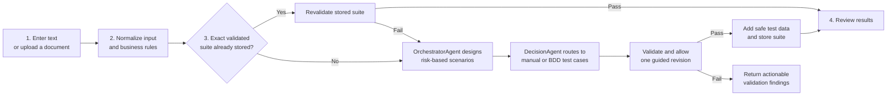
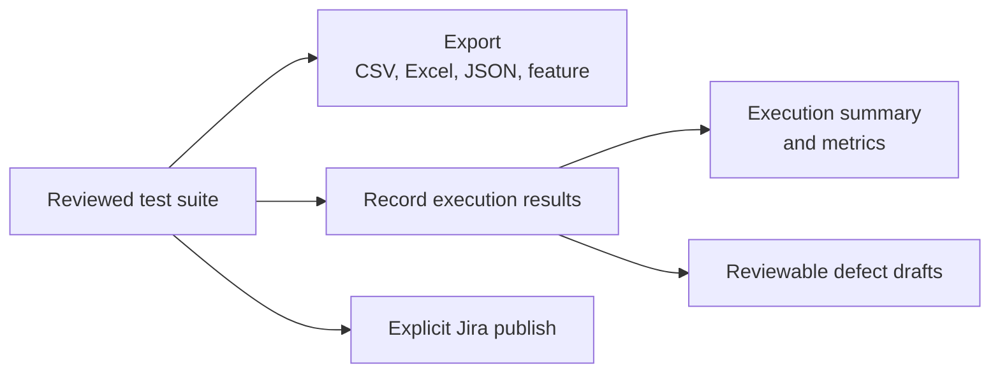
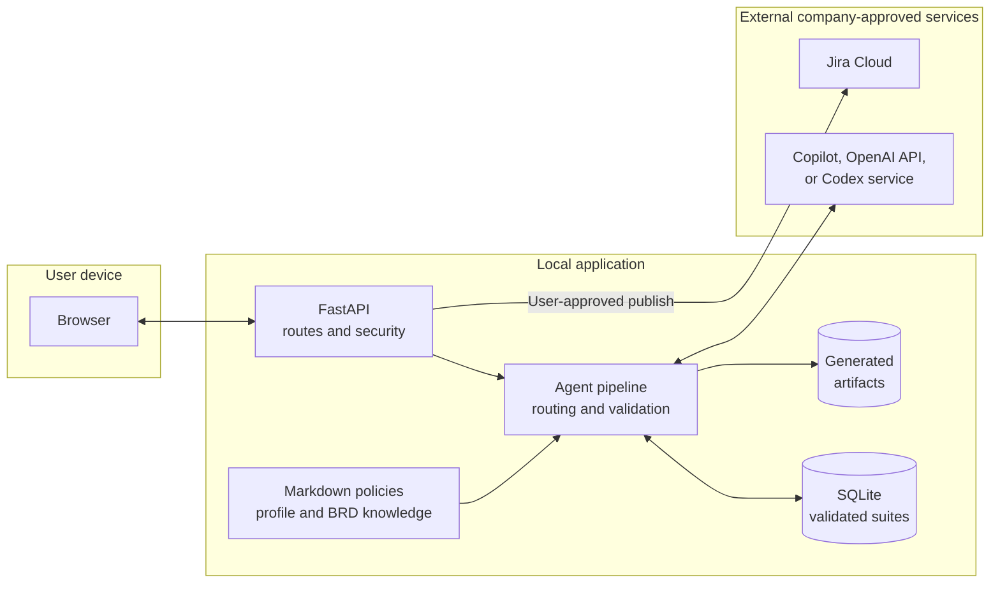
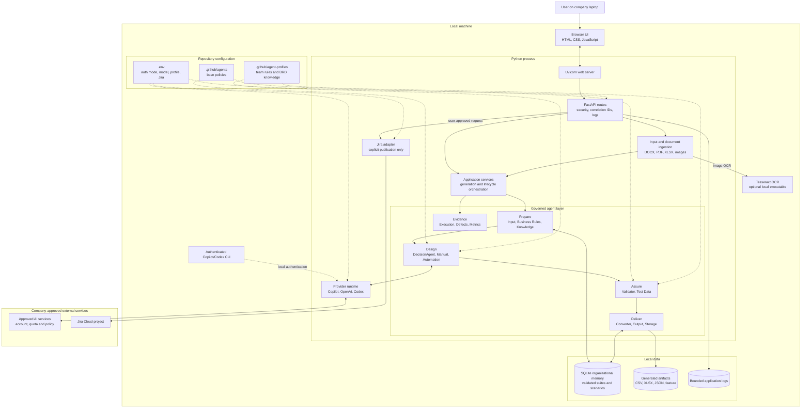

# Auto Finance Quality

Automobile finance test design from quotation requirements to reviewed execution evidence.

The workspace is tailored to vehicle finance quotation testing, with guidance for PCP, HP, LP,
PCH, BCH, PFL and BFL. Its existing `auto-finance-quotation` profile supplies the domain baseline;
current requirements and approved contracts remain authoritative. The product guide is reference
material and does not silently insert business rules, financial formulas or request fields.
Credit decisioning, contracting and servicing require separately supplied requirements.

Validated cases can also produce [JMeter and SQL/Oracle test script packs](docs/test-script-packs.md).
The execution dashboard provides run summaries, test-level evidence and filtered CSV exports.

A local web application that turns a user story, feature description, or acceptance criteria
into structured test cases. It classifies cases as critical, smoke, sanity, or regression,
generates safe synthetic test data, exports Xray-ready CSV/Excel/JSON through the Context
Converter Agent, and can attach the CSV to a Jira Cloud
story with a summary comment.

Requirements can be pasted or uploaded as Word (`.docx`), text PDF, Excel (`.xlsx`), Apple
Pages (`.pages`), Apple Numbers (`.numbers`), PNG, or JPEG. Pages/Numbers packages are read from
Quick Look previews or legacy XML when available; binary-only IWA packages must first be exported
from the Mac as PDF or XLSX. A document-ingestion component extracts normalized text, the requirement-to-test-case
agent generates the suite, and an independent validator reports coverage, traceability,
duplicates, clarity, and expected-result quality. Image extraction uses local Tesseract OCR.

The application uses twenty discoverable agents across the test lifecycle. In addition to
requirement ingestion, manual/automation generation, validation, conversion, and storage, it can
normalize business rules, recall approved knowledge, fill privacy-safe test data, summarize test
execution, draft defects, and calculate quality metrics. `GET /api/agents` lists every agent's
responsibility, runtime, and capabilities. Only suites that pass independent validation are newly
stored for future exact-match reuse.

The homepage now provides five connected tabs:

1. **Requirements:** read a BRD upload, pasted command prompt, or linked Jira ticket. Review the
   extracted text and shared rules before continuing.
2. **Stories:** create source-grounded stories with acceptance criteria. Review or edit them and
   select **Use these stories**.
3. **Scenarios:** create format-neutral coverage linked to those story IDs. Review or edit the
   preconditions, actions and expected results, then select **Use these scenarios**.
4. **Test cases:** choose manual, automation or both; generate and validate cases with ST/SC
   traceability. Existing review, acceptance, feature-file and automation-pack exports remain available.
5. **Execution:** record actual manual outcomes, or inspect and run configured ReqnRoll features.
   Automation is enabled only when the approved suite's exported feature exactly matches a file in
   the configured `AUTOMATION_PROJECT_PATH` project's `Features/` directory. Install the reviewed
   complete pack, dependencies, bindings and approved input data and configure the target environment
   first. Set `API_BASE_URL` and optional `API_BEARER_TOKEN`/`API_FIXTURE_FILE` in `.env`
   or the server environment for generated API packs. All features in that configured project run together; Scenario Outlines expand into examples.
   Submitted scenarios appear while the runner works; individual outcomes and example names come
   from TRX results when the run finishes. Repository checks do not validate an unrelated generated suite.

Draft handoffs remain available while navigating within the workspace; reloading the page clears
these drafts. Changing requirements clears downstream drafts and execution results. Story and
scenario policies live in `story-generator.agent.md` and `scenario-generator.agent.md`; stage 4's
conversion instructions live in `workflow-test-cases.agent.md`. Story/scenario generation uses the
configured artifact-provider fallback (Copilot, configured OpenAI, then available Codex); test-case
generation retains the existing selected provider routing. No Jira stories are published automatically.

The `/api/workflow` endpoints expose document reading, stories, scenarios, validation of edited
handoffs, test-case conversion, execution planning and controlled execution. Open API documentation
for their schemas. Validation rejects duplicate IDs, unsupported source excerpts and broken story links.

Agent behavior is defined in readable `.github/agents/*.agent.md` files. The FastAPI/Python layer
loads the relevant DecisionAgent, specialist, and quality-gate policies into each Copilot session and
retains deterministic enforcement for validation, conversion, storage, security, and the web UI.
Team and project customization is layered through `.github/agent-profiles/<profile>/`. Set
`AGENT_PROFILE` to select a profile; `profile.md` applies common rules and optional files named
after an agent add role-specific conventions. The base safety and quality policies cannot be
replaced by a profile.

The active default is `auto-finance-quotation`. Its `knowledge/quotation-brd-baseline.md` is the
reviewable BRD v1.0 knowledge source used by the agents. This is prompt-time grounded context, not
irreversible model fine-tuning; updating or reverting the Markdown changes the baseline cleanly.

At generation time, choose manual test cases, BDD automation scenarios, or both in the same run.
Manual cases appear as compact scenario/title rows that expand to show preconditions, numbered
`Step 1`, `Step 2` actions, corresponding expected results, test data, and traceability. Automation
scenarios use `Scenario / Given / When / Then`. Both formats retain category, priority,
automation/manual feasibility, a decision rationale, test data, acceptance-criteria traceability,
and CSV/JSON/Jira export support.

BDD output is ready for SpecFlow/ReqnRoll feature files. Shared setup is promoted into a feature
`Background`, while repeated quoted and numeric values are parameterized for reusable C# bindings.
Data-driven flows use `Scenario Outline` with parameter placeholders and `Examples` tables where
appropriate. The results screen can copy a scenario or feature and generate, review, copy, and
download ReqnRoll C# step definitions. Choose **Step definitions (.cs)** for a single file
containing reusable binding declarations and pending method stubs to implement in your framework.
This option makes no AI calls and does not retrieve or generate implementation packs.
Choose **Automation pack** separately to generate implementations and supporting files, with a ZIP
download. Both options require a validated suite containing automation Gherkin.

The full C# pack generator includes executable common API bindings for named JSON request
fixtures, explicit HTTP method/path submission, status checks, JSON field checks, and exact decimal
comparisons. It supplies a scenario context and an `IHttpClientFactory`-backed client alongside the
bindings. Download the ZIP and retain its separate `.cs` files in a .NET 8+ ReqnRoll project with
`Microsoft.Extensions.Http`. This follows the [ReqnRoll context injection](https://docs.reqnroll.net/latest/automation/context-injection.html)
and [.NET HTTP client factory](https://learn.microsoft.com/en-us/dotnet/core/extensions/httpclient-factory)
patterns.

Set `API_BASE_URL` and, when needed, `API_BEARER_TOKEN` in the test environment. The step
`When the request is submitted` additionally requires `API_REQUEST_METHOD` and `API_REQUEST_PATH`.
Approved JSON object/array values in structured `test_data` become fixtures keyed by their names;
`API_FIXTURE_FILE` can instead point to a JSON object mapping fixture names to request payloads.
Missing/conflicting fixture data fails explicitly. Complete common-step suites use the implemented
bindings directly. Other suites use Copilot, with configured OpenAI/Codex fallback, to implement
their additional steps from the approved suite and common implementation baseline. A static
implementation check rejects placeholder/pending code, empty and throw-only methods, missing
coverage, and missing binding methods. Each provider gets one implementation revision before
the next configured provider is tried; schema-valid but incomplete code also triggers fallback.
Providers that fail transport/authentication/quota checks are not retried during that revision.
Validated C# bundles are stored in organizational memory. Repeated automation scenarios reuse
the complete bundle without another provider call, including when case IDs or ordering change.
Matching preserves Gherkin, fixtures, preconditions, expected results and project context;
changed instructions or support templates invalidate earlier matches. For suites combining
duplicate and new scenarios, matching stored C# is supplied as implementation knowledge and
the resulting complete bundle is validated again. Retrieved bundles also pass the current
static checks; these checks do not establish compilation or successful execution. Set
`ORGANIZATIONAL_MEMORY_ENABLED=false` to disable both C# storage and retrieval.
Missing runtime values (fixtures, outcome mappings, oracle outputs, field paths and tolerances)
can be loaded by concrete generated code from validated configuration documented in artifact notes.
These values must be supplied before running the tests; unknown business rules are never invented.
Unchanged shared C# helpers are assembled locally instead of regenerated by the model. Incomplete artifacts
are never returned as C# files or made downloadable. If all providers are unavailable or required
project contracts remain missing, the app reports the generation issue instead of emitting stubs.
The static check does not replace compiling and running the generated code in its target project.

The repository also includes a live C# BDD automation project at
`automation/QualityLifecycle.Automation.csproj`, separate from the Python unit and integration
tests under `tests/`. Its ReqnRoll features cover the UI
workspace, health and validation APIs, protected generation requests, and provider-secret
redaction checks. The project uses Playwright for browser scenarios and `HttpClient` for API
scenarios; configure `QUALITY_LIFECYCLE_BASE_URL` (and, for protected environments,
`API_AUTH_TOKEN`, `APP_USERNAME`, and `APP_PASSWORD`) before running it. See
`automation/README.md` for setup and tag filters. The C# projects are grouped in
`QualityLifecycleStudio.sln`.
The **Run BDD tests** action on **Progress & execution** invokes this fixed project through the
local Automation Execution Agent, without requiring a generated suite. It does not accept shell commands
from the browser; only approved environment values are passed to the process, output is bounded
and secrets are redacted. The results describe the fixed repository checks, not the generated scenarios, and do not
feed generated-suite metrics or defects. The runner reads structured TRX results, streams a
bounded output tail, and terminates the process tree on timeout or cancellation. Missing
results are reported as runner errors rather than invented test failures.

The step `Given fixture <fixture> sets <customerType> and <productType> as <eligibility>`
also supports quoted values and selects an approved eligibility fixture record. Its named fixture
uses `{"eligibilityCases":[{"customerType":"…","productType":"…","eligibility":"…",
"request":{…}}]}`. Supply real approved values and request fields through `test_data` or
`API_FIXTURE_FILE`. Customer/product fields in the request must match the selected record.
Only `request` is submitted; the fixture's eligibility metadata never becomes an API payload field.
This is fixture selection, not a change to downstream eligibility configuration. Missing,
duplicate, or inconsistent combinations fail with a specific fixture-data error.

Run the generated C# compile/runtime regression check with
`RUN_CSHARP_TESTS=1 python3 -m pytest tests/test_reqnroll_implementations.py -q`
(requires .NET 8+ and NuGet access or cached dependencies).

Before calling an AI provider, the application checks a repository-local organizational memory at
`.agent-memory/test_suites.db`. An exact normalized match returns the previously validated suite
immediately and avoids a new premium request. New results are stored for subsequent reuse. The
database is local operational data and is excluded from source control.

Generation preserves every unique case produced from the supplied requirements, business rules,
agent policies, and quality-gate feedback. The final count is coverage-driven rather than capped by
the application, although provider response-size, latency, and account limits still apply. Before
delivery, select individual cases in **Generated Suite**. Downloads, Jira publication, reviewer
entry, and **Approve selected** are kept together there. Reviewer and Jira issue fields show inline
validation. Multi-step Excel exports merge repeated case-detail cells instead of duplicating them
on every step row.

The UI shows payload-free orchestration events in the generation popup and lifecycle panel. The
top-right notification bell records run completion, failures, and system updates. A separate notice
tells the user when an approved exact-match suite came from the knowledge base. Sign out is
available from the adjacent profile menu rather than the sidebar.

## Run locally

Use **Review comments → Save review & regenerate** in the generated suite to request changes
for manual, automation, or combined tests. Mention case IDs for targeted corrections. The app
saves the comments before regeneration, preserves the original text or extracted document,
business rules, testing mode, and selected provider, and sends the feedback through the normal
specialists and quality gate. Failed or cancelled regeneration retains the previous suite and
saved comments; successful regeneration clears prior approval and generated file previews.

Feedback is stored in the organizational knowledge database and reused for the same requirements,
business-rule context, and testing mode, including when the provider changes. This is prompt-time
knowledge retrieval, not model fine-tuning. The latest ten reviews and a bounded index of previous
cases guide generation; only validated revised suites enter the reusable suite cache. Knowledge
storage must be enabled. `POST /api/reviews` saves feedback independently; `POST /api/agent/run`
then generates with the saved feedback. Both text and document generation responses include
`source_request` so reviews do not accidentally use subsequently edited input fields.

Saved suites carry a generation-policy version. A duplicate request matching older knowledge
generates a fresh suite using the current scenario and test-case naming instructions. Only a
Quality Gate-approved result replaces the saved suite; failed refreshes retain the earlier data.
Subsequent duplicates reuse the refreshed version without another generation call.

The LLM picker loads available routes from `/api/llm/models` instead of a fixed model list.
Unconfigured providers, failed access checks, disabled Copilot models and exhausted reported
Copilot quota are excluded. **Refresh models** checks access again; generation is disabled when
no route passes. OpenAI model permissions and Codex sign-in are checked without generation calls;
these checks do not establish remaining OpenAI billing credit or Codex usage allowance.

1. Install Python 3.11 or newer.
2. Create and activate a virtual environment:

   ```bash
   python3 -m venv .venv
   source .venv/bin/activate
   pip install -e '.[dev]'
   ```

Browser login is enabled when `APP_PASSWORD` and `SESSION_SECRET` are both configured. Set
`APP_USERNAME`, use a password of at least 12 characters, and generate a random session secret of
at least 32 characters. Signed sessions are stored in an HttpOnly, SameSite=Strict cookie and
expire after `SESSION_TTL_SECONDS` (eight hours by default). Bearer-token API clients remain
supported independently through `API_AUTH_TOKEN`.

3. Copy `.env.example` to `.env`.
4. Ensure GitHub Copilot CLI is installed, then authenticate it using your Copilot-enabled
   account:

   ```bash
   copilot login
   ```

   Your organization administrator must enable the Copilot CLI policy. For non-interactive
   deployments, configure `COPILOT_GITHUB_TOKEN` instead. Optional fallback providers are enabled
   with `OPENAI_API_KEY` and an authenticated Codex CLI (`codex login`).

5. Start the app:

   ```bash
   uvicorn app.main:app --reload
   ```

6. Open <http://127.0.0.1:8000>. API documentation is at `/docs`.

On Windows PowerShell, activate the environment with `.\.venv\Scripts\Activate.ps1`. If the
`uvicorn` command is not on `PATH`, use `python -m uvicorn app.main:app --reload` on any platform.

## Temporary guest access on Render

The Render Blueprint enables **Continue as guest** on the sign-in page until
**7 October 2026 at 23:59 London time**, using
`TEMPORARY_GUEST_ACCESS_UNTIL=2026-10-07T23:59:00+01:00`.
For an existing Render service, deploy this code, set that variable in **Environment**,
and choose **Save and deploy**. Keep `APP_PASSWORD`, `SESSION_SECRET`, and `API_AUTH_TOKEN`
configured. Normal sign-in remains available and gives the account its usual access.

Guests must select the button to receive a signed HttpOnly guest cookie. They can only view
**Quality workspace** and **Progress & execution**. A banner explains this limitation;
other navigation is hidden, and the server rejects other pages, APIs, and write operations.
Guests cannot generate tests, run executions, change data, or administer accounts. They can
browse execution history and download its reports. Guest access does not grant an administrator
identity. Signing out clears the guest cookie; signing in replaces guest access with the account.

The absolute deadline is checked on every request, including existing guest sessions; restarting
the service does not extend it. Open guest tabs return to sign-in at expiry. Remove or empty the
variable and redeploy to end guest access early. A different deadline must include a timezone.
Guest access is disabled when the variable is unset or no session secret is configured.

## Deploy on Render

The repository includes a `render.yaml` Blueprint for deploying the Dockerized FastAPI webpage as
a Render web service. In Render, choose **New → Blueprint**, connect this repository, and deploy
the Blueprint from the `main` branch. Render builds `Dockerfile`, binds the service to its supplied
`PORT`, and checks `/api/ready` before routing traffic.

During the first Blueprint setup, provide `APP_PASSWORD` (at least 12 characters), and provide
`COPILOT_GITHUB_TOKEN` and/or `OPENAI_API_KEY` if generation should be available in the hosted
service. `SESSION_SECRET` and `API_AUTH_TOKEN` are generated by Render. Add a custom domain to
`ALLOWED_HOSTS` if you use one; the Blueprint default allows the generated
`quality-lifecycle-studio.onrender.com` hostname.

The checked-in free-service Blueprint does not retain SQLite knowledge across Render
restarts, redeploys or spin-downs. For durable knowledge, use a paid service with a
persistent disk mounted at `/srv/app/.agent-memory` (the current database directory),
or implement an external database backend. Setting `ORGANIZATIONAL_MEMORY_ENABLED=true`
enables reuse but does not make the filesystem persistent. Back up existing databases
before changing storage; mounting an empty disk does not transfer previous data.
See [Render persistent disks](https://render.com/docs/disks) and
[free-service storage limitations](https://render.com/docs/free#local-files-lost-on-redeploy).

Knowledge source separates validated test suites from saved story/scenario batches.
A zero suite count does not mean that workflow knowledge is empty. Use **Refresh knowledge**
and inspect Knowledge Agent events for the current request. Only matching requests can
reuse saved artifacts; changed inputs, model, rules or generation policies can cause a miss.

## Test lifecycle and API

The browser provides the main workflow. The HTTP API also exposes each governed lifecycle action
independently:

| Stage              | Endpoint                                        | What it does                                                                                           |
| ------------------ | ----------------------------------------------- | ------------------------------------------------------------------------------------------------------ |
| Inspect            | `GET /api/health`                               | Shows service, Copilot authentication mode, model selection, profile, and memory status.               |
| Discover           | `GET /api/agents`                               | Lists registered agents, responsibilities, runtimes, and capabilities.                                 |
| Observe            | `GET /api/logs`                                 | Returns bounded operational logs, optionally filtered by correlation ID.                               |
| Trace live         | `GET /api/generation/{request_id}/events`       | Returns incremental payload-free agent lifecycle events.                                               |
| Accept             | `POST /api/output/accept`                       | Stores selected approved manual and automation artifacts in the fixed output directory.                |
| Generate           | `POST /api/generate`                            | Generates test cases directly from a validated JSON request.                                           |
| Orchestrate        | `POST /api/agent/run`                           | Runs the governed multi-agent generation and validation pipeline.                                      |
| Upload             | `POST /api/generate/document`                   | Extracts a supported document and generates a validated suite.                                         |
| Override rules     | `POST /api/business-rules/document`             | Extracts a document into a reviewable replacement business-rule overlay.                               |
| Expand             | `POST /api/generate/expand`                     | Adds distinct risk-based coverage to an existing suite.                                                |
| Cancel             | `POST /api/generation/{request_id}/cancel`      | Requests cancellation of an active generation.                                                         |
| Enrich             | `POST /api/test-data`                           | Fills missing test data with case-aligned synthetic values.                                            |
| Record             | `POST /api/execution`                           | Validates execution results and calculates a pass-rate summary.                                        |
| Triage             | `POST /api/defects`                             | Creates human-review-required drafts for failed tests.                                                 |
| Measure            | `POST /api/metrics`                             | Calculates coverage, execution, and defect metrics.                                                    |
| Convert            | `POST /api/context-converter/{output_format}`   | Converts validated manual suites to CSV, Excel, PDF or JSON; automation scenarios to `.feature` files. |
| Export             | `POST /api/export/csv`                          | Produces a CSV download.                                                                               |
| Publish            | `POST /api/jira/publish`                        | Attaches selected cases to Jira after an explicit user action.                                         |
| Read Jira          | `GET /api/jira/issues/{issue_key}/requirements` | Reads a story description and Xray/Jira acceptance criteria.                                           |
| Generate from Jira | `POST /api/jira/generate`                       | Reads a Jira story and generates a validated test suite from it.                                       |

Execution results are supplied by an approved manual or automation source; this application does
not execute arbitrary test commands. Defects remain drafts until a person reviews them, and Jira
publication is never automatic.

## Engineering quality

The repository enforces a shared organizational baseline through executable checks:

```bash
make quality
```

This runs Ruff formatting/lint policy, MyPy type checks, tests with branch coverage, and Python
compilation. CI also audits installed dependencies for known vulnerabilities. The application
ships with JSON request logs, correlation IDs, baseline browser security headers, a non-root
container image, bounded document processing, sanitized provider errors, and an explicit
human-controlled Jira publication boundary.

## AI provider runtime

Automatic mode tries GitHub Copilot first, then the OpenAI API, then the locally authenticated
Codex CLI. The UI also allows a provider/model to be selected explicitly. Copilot uses either the
locally signed-in GitHub identity or `COPILOT_GITHUB_TOKEN`; OpenAI requires `OPENAI_API_KEY` with
separate API billing; Codex requires the `codex` executable and `codex login` on the machine that
runs the service. A local Codex login is not automatically available inside Render.

Provider quotas, rate limits, account eligibility, and model policies still apply. Leave
`COPILOT_MODEL` or `CODEX_MODEL` blank to use the relevant account default, and configure
`OPENAI_MODEL` for the API fallback. Never commit credentials. If all configured providers are
unavailable, the UI returns one combined, reference-ID-bearing error describing each provider.

Codex C# artifact generation uses `CODEX_ARTIFACT_TIMEOUT_SECONDS` (default 900 seconds),
separately from `CODEX_TIMEOUT_SECONDS` (default 300 seconds) for suite generation. Set the
artifact limit up to 1800 seconds for larger suites and restart the service to apply changes.

## Jira Cloud setup

Set `JIRA_BASE_URL`, `JIRA_EMAIL`, and `JIRA_API_TOKEN` in `.env`. The Jira user needs Browse
Projects to import stories, plus Add Attachments and Add Comments to publish results. The app uses
Jira Cloud REST API v3 and supports Jira projects with Xray by reading the native story description
and acceptance-criteria custom fields. Fields named `Acceptance Criteria` are discovered
automatically; set `JIRA_ACCEPTANCE_CRITERIA_FIELDS` to comma-separated custom-field IDs or exact
field names when your project uses different labels. In the browser, choose **Load story**, review
the imported requirement, and generate normally. The `/api/jira/generate` endpoint offers the same
fetch-and-generate flow in one API call.

Publishing is always initiated by the user and attaches an Xray-ready timestamped CSV; it does not
create or overwrite Jira/Xray issues. Jira Data Center and direct Xray test-issue creation require
separate authentication and adapters.

## Develop with GitHub Copilot

Open the folder in VS Code, install the GitHub Copilot and GitHub Copilot Chat extensions, and
sign in. Repository guidance is already provided in `.github/copilot-instructions.md`.

This repository also includes:

- `.github/agents/test-designer.agent.md`: a custom QA-focused Copilot agent.
- `.github/prompts/add-test-generation-feature.prompt.md`: a reusable agent-mode prompt.
- `.github/workflows/ci.yml`: GitHub Actions checks for every pull request and main-branch push.

In Copilot Chat, select the `test-designer` custom agent when designing or changing test-suite
behaviour. Use `/add-test-generation-feature` for implementation tasks where
prompt files are supported.

Useful Copilot Chat tasks:

- `Add unit tests for JiraClient using respx; cover attachment and comment failures.`
- `Add an editable review screen before publishing while preserving the TestSuite schema.`
- `Add an Xray Cloud publisher as a new adapter without changing JiraClient.`
- `Add Playwright end-to-end tests for generation, download, and validation errors.`

Always review generated code and test cases. The AI output is a draft, not evidence of coverage
or a substitute for security, accessibility, performance, and domain-expert testing.

## Architecture

The design is hybrid: GitHub Copilot proposes test content, while local Python code controls input
validation, routing, schema enforcement, quality gates, persistence, conversion, observability,
and external publication. Markdown files describe agent behavior and project knowledge, but they
cannot bypass these code-enforced boundaries.

### What happens when a user generates tests



The memory check can avoid a Copilot request for an exact known requirement. A stored suite is
still revalidated before use. For a new requirement, OrchestratorAgent reads the normalized UI or BRD
input and designs the scenario intent. DecisionAgent then selects the manual specialist, automation
specialist, or both to transform that intent into the requested manual or BDD test cases. Output
that still fails after one findings-driven revision is not
stored or offered for publication.

After generation, a user can choose only the actions they need:



### Where each responsibility runs



Only AI generation crosses the selected provider boundary. Document processing, validation, synthetic
fallback data, execution summaries, defect drafts, metrics, storage, and exports run locally.
Jira is contacted only when a user explicitly publishes selected cases.

### Complete infrastructure view

This diagram combines the deployment boundaries and major runtime components. Solid arrows show
runtime calls or data movement; dotted arrows show configuration supplied to the pipeline.



The entire FastAPI application, deterministic agent logic, SQLite memory, generated files, and
logs stay on the application host. Requirement content is sent only to the provider selected for
generation. Jira receives only the cases selected in an explicit publish request.

### Agent responsibilities

The eighteen roles are grouped below by purpose so their relationship is easier to scan:

| Group                | Agents                                                                   | Responsibility                                                                                     |
| -------------------- | ------------------------------------------------------------------------ | -------------------------------------------------------------------------------------------------- |
| Prepare              | Input, Business Rules, Knowledge                                         | Extract and normalize requirements, bind `BR-*` rules, and recall exact validated suites.          |
| Generate             | OrchestratorAgent, DecisionAgent, Manual Generator, Automation Generator | Ingest UI/BRD input, design scenario intent, and route it into requested manual or BDD test cases. |
| Assure               | Test Case Validator, Test Data                                           | Enforce coverage and traceability rules and fill missing values with privacy-safe synthetic data.  |
| Deliver              | Context Converter, Output, Test Storage                                  | Convert approved suites, retain artifacts, and store validated knowledge for exact-match reuse.    |
| Learn from execution | Execution, Bug Reporter, Metrics                                         | Validate supplied results, draft defects for review, and calculate transparent quality measures.   |

Agent behavior lives in `.github/agents/*.agent.md`. Team-specific rules and version-controlled
knowledge are layered from `.github/agent-profiles/<profile>/`; the default profile is
`auto-finance-quotation`. This is prompt-time grounding, not model training.

### Code map

- `app/agents/`: typed capability contracts, declarative agent definitions, and the shared
  fail-closed Copilot runtime.
- `app/agents/runner.py`: the sole owner of Copilot SDK sessions, restricted options, timeouts,
  event handling, JSON extraction, and Pydantic structured-output validation.
- `app/agents/lifecycle_agents.py`: business-rule, knowledge, test-data, execution, defect, and metrics agents.
- `app/agents/test_case_validator.py`: independent deterministic test-suite validation agent.
- `app/services/`: application use-case orchestration, independent of HTTP transport.
- `app/services/document_ingestion.py`: bounded Word, PDF, Excel, and image text extraction.
- `app/dependencies.py`: composition root for the approved runtime and application services.
- `app/generator.py`: test-suite request/normalization logic using Markdown instructions and the
  shared structured-agent runtime.
- `app/models.py`: validated API and model-output contracts.
- `app/jira.py`: Jira Cloud attachment/comment integration.
- `app/exporter.py`: CSV export.
- `app/static/index.html`: dependency-free browser UI.
- `tests/`: fast local tests; external APIs should always be mocked.

See [architecture](docs/architecture.md), [operations](docs/operations.md),
[engineering standards](docs/engineering-standards.md), [contributing](CONTRIBUTING.md), and
[security policy](SECURITY.md) for the organization-standard framework and governance rules.

For company adoption, use the [project prerequisites](app/documentation/company-project-prerequisites.md),
[solution requirements](app/documentation/company-solution-requirements.md), and
[implementation checklist](app/documentation/company-implementation-checklist.md) as the approval and delivery
pack.

For stakeholder presentations, use the [client demonstration guide](docs/client-demo-guide.md)
and the downloadable [client demo PowerPoint](docs/Quality_Lifecycle_Studio_Client_Demo.pptx).

## User accounts and roles

The account configured with `APP_USERNAME` and `APP_PASSWORD` is the initial administrator.
Sign in and open **Profile → Manage users** to create accounts with first and last names,
usernames, passwords, and either the **User** or **Admin** role. Users can access the workspace;
only admins can list accounts, create users, amend roles, and enable or disable access.
Use an account’s edit icon to populate the user form. Update first and last names, choose Role
and Application access with inline radio options, then select Update user. Leave the password blank
to retain it or enter a replacement. The username stays fixed. Cancel editing returns to
Create user mode. Saved edits revoke existing sessions. The delete icon removes an account after confirmation;
admins cannot delete themselves or the initial administrator. There is no public
registration. Disabling an account immediately invalidates its browser sessions. Re-enabling
requires a fresh sign-in. Admins cannot disable themselves or the initial administrator.

Accounts persist in `USER_DATABASE_PATH` (default `.agent-memory/users.db`). Passwords are
stored as salted scrypt hashes. Keep this database on persistent storage when deploying.
The existing API token grants workspace API access but cannot manage users; account management
requires an authenticated admin browser session. Configure browser login before granting access.

Specific-test reviews: mention exact test IDs (for example, `TC-003`) or full test titles in review comments. Regeneration replaces only those tests and preserves every other test and its position. Unknown test IDs are rejected. Revisions that omit or duplicate a requested ID, or change its execution mode, fail without replacing the displayed suite. Comments without a specific test apply to the whole suite.

Per-test review: click **Review** on a manual or automation test to reveal its comment form. **Save review & regenerate** saves feedback and updates only that test. The selected test ID is sent automatically; IDs mentioned within comments do not expand the review scope.

## Gemini test generation

Set `GEMINI_API_KEY` in the server `.env` and restart. `GEMINI_MODEL` defaults to
`gemini-3.8-flash` and can select another model supported by your account. Gemini appears
in the model picker when its metadata access check succeeds. The check does not verify
remaining generation quota. Automatic test generation tries Copilot, OpenAI, Gemini,
then Codex. Explicit Gemini selection uses Gemini only. Manual and BDD output use the
existing validation and review flow; blocked, truncated, and invalid responses fail.

The integration uses [Google’s structured-output REST API](https://ai.google.dev/gemini-api/docs/generate-content/structured-output).
Gemini support applies to test suites; the full C# pack retains its existing providers.

## Shared rules, standards and automation languages

The shared rules editor now reads and saves `.github/agents/business-rules.agent.md` on the server.
Only its marked shared-business-rules section is replaced; agent guidance is preserved.
See the [agent editing guide](.github/agents/README.md) for rules, conditions, and training examples.
Agent and profile Markdown edits take effect on the next request and invalidate stale generated suites.
This is the single persistent placeholder for project rules. Start with an empty array and add
objects such as `{"id": "BR-001", "description": "Your approved business rule"}`. Text and imported
rules from the editor are saved here before generation. Every generation pipeline loads the file
before knowledge lookup and provider calls. Existing API clients can still supply transient rules;
conflicts with a shared rule ID are rejected. Rules and standards apply across this workspace,
so shared edits affect other users. Keep the `workspace/` directory on persistent storage.

Edit `workspace/automation-standards.md` for automation conventions and
`workspace/feature-standards.md` for Gherkin conventions. Agents reread these files on generation.
Changes to feature standards invalidate cached suites while retaining saved review feedback;
C# implementation memory also incorporates the automation standards. Generated feature files have
no tags, including scenario, outline and Examples tags. Tag-looking text inside doc strings is
preserved as data. Existing repository smoke-test tags are independent of generated artifacts.

Choose **Automation language** before requesting step definitions or an automation pack:
C# (ReqnRoll), Java (Cucumber-JVM), Python (Behave), JavaScript or TypeScript (Cucumber-JS), or Ruby
(Cucumber-Ruby). The Multi Language Support Agent supplies language-specific pending declarations
for bindings-only requests. Full packs use the configured providers and the shared standards to
implement the approved scenarios, with static validation before delivery. New language packs
include dependency manifests, setup instructions and an untagged feature file. Missing project
contracts or incomplete provider output cause generation to fail; static checks do not establish
successful compilation or execution. Bindings-only adapters supply standard framework declarations;
custom coding conventions are provided to full-pack generation. Gherkin natural-language dialect
selection is separate from this programming-language selector and is not changed here.

The new endpoints are `GET/PUT /api/workspace/rules`, `GET /api/workspace/standards`,
`GET /api/automation/languages`, and `POST /api/step-definitions/languages/{bindings,pack,download}`.
Legacy C# endpoints remain available. The generic download endpoint safely archives reviewable
source files; it does not certify user-supplied files as complete implementations.
The adapters follow [Cucumber step definitions](https://cucumber.io/docs/cucumber/step-definitions/)
and [Behave regular expression matchers](https://behave.readthedocs.io/en/stable/tutorial/).

## BDD execution history and Allure reports

**Progress & execution** shows only runs of the existing repository BDD project,
`automation/QualityLifecycle.Automation.csproj`. **Run BDD tests** works without generating a suite.
Python/C# unit tests, test generation, automation-pack creation, and manually entered case results
are excluded from this view.

Each run records its timestamp, duration, status, bounded redacted output, and measured pass/fail/not-run
counts. Select **Show in chart** to view a historical run in the doughnut chart. Not run means the
runner reported a skipped test; missing results display as unavailable rather than inferred counts.
The page refreshes every five seconds and preserves the selected historical run.

The native `Allure.Reqnroll` adapter records scenarios and their steps. After execution, Allure 2
CLI generates a standalone HTML report with `--single-file`. Each report has a **Download Allure
report (.html)** link and opens locally without a report server. Install Java and Allure 2 CLI on
a local execution host and restore the BDD project before running; the Docker image already
bundles these prerequisites. For Render configuration, see `automation/README.md`.
Missing Allure prerequisites do not change the test result: the run shows a separate report error.
Older runs without Allure results cannot be retroactively given a report.

`POST /api/automation/run` accepts `{}` (legacy suite payloads remain accepted but do not select tests).
`GET /api/automation/history` returns only repository BDD runs. Authenticated report downloads use
`GET /api/automation/reports/{report_id}`. The existing `/api/dashboard` API remains available for
other workspace clients. One BDD run may execute at a time per server process.

History persists in `dashboard.db` beside `ORGANIZATIONAL_MEMORY_PATH`, retaining 200 BDD runs
independently of other activity. The latest 200 new HTML reports are retained in `automation/TestResults/Reports/`
(beside the configured automation project). Keep this directory on persistent storage.
Existing downloads also resolve historical reports from `automation-reports/` beside the database. Active runs are process-local.
Reports contain native scenario/step results and redacted text diagnostics; raw attachments are
excluded. Access uses the workspace's existing authentication settings.

## Lifecycle management API

The Quality Lifecycle page focuses on coverage, traceability and quality reporting.
Formal requirement approvals and execution management are available through `/api/stlc`;
the page does not include management forms. The following describes that API workflow.
Records persist in `stlc.db`
beside `ORGANIZATIONAL_MEMORY_PATH`; use persistent storage on the deployment host to
retain them across redeployments. This is a shared workspace, consistent with the existing
shared business rules. Project identifiers organize records; they are not tenant access boundaries.

1. Save a requirement with its project, stable key, owner, source, acceptance criteria and
   change reason. Submit it for review, then approve or reject with a recorded comment.
   Missing criteria and a small set of potentially ambiguous phrases prevent approval;
   this check supplements human review rather than proving requirement completeness.
2. Select approved requirement versions to create a baseline. Review and approve the
   baseline, then save the generated suite with explicit case-to-requirement mappings.
   Review its saved test snapshot and approve the suite version.
3. Create a cycle tied to that suite version, application build and environment, assigning
   each case. Record manual step outcomes and evidence URLs, or import CI `results.json`.
   Attempts are append-only. Imported run keys are idempotent; unknown cases, duplicate
   results and build/environment mismatches reject the whole import.
4. Create defects from failed attempts. Link an existing Jira issue or explicitly publish
   a Jira Bug, then synchronize its remote status. Jira status is displayed separately from
   local defect disposition: closing locally requires a passing linked retest. If remote
   creation times out, reconcile with Jira and link the created issue instead of retrying
   blindly. Jira projects must support the `Bug` issue type and the configured account must
   have the relevant issue permissions.
5. Revise a requirement to create a new version. The impact view identifies affected tests,
   suite versions and cycles. A changed baseline cannot start new cycles; review new
   requirements, baseline and suite snapshots first. Historical execution remains linked to
   its original version. Retesting a fixed build uses a new cycle for the same suite version
   and can reference a failure in an earlier cycle.

The cycle report counts the latest attempt per case, retains complete attempt history, and
shows whether all tests linked to a requirement passed. Pass rate uses passed plus failed
cases as its denominator; blocked and not-run cases remain visible separately. No execution
produces an unavailable pass rate. A passing requirement row describes that baseline only;
change-impact warnings identify newer requirements requiring review.

### Reviewed C# execution in CI

The application host never executes uploaded generated code. Generate and review a C# pack
for a saved suite and use the lifecycle API to export a reviewed CI bundle for its cycle. Provide the project's
relative `.csproj` path and explicit mappings from exact TRX test names to stable case IDs.
Outline rows may map to the same case; one failed row fails the aggregated case, and any
unexecuted row prevents a passing case result. Unmapped or missing cases stop conversion.

Commit the bundle as `automation-packs/<cycle_id>.zip` through your repository review process.
Configure the GitHub Actions environment `stlc-execution` with required reviewers, variable
`STLC_TARGET_URL`, and only the target-test credentials needed by the reviewed suite:
`STLC_TARGET_TOKEN`, `STLC_TARGET_USERNAME`, `STLC_TARGET_PASSWORD`. Manually dispatch
**Generated suite execution** with its cycle ID. The workflow verifies bundle hashes, builds
and runs on an ephemeral GitHub-hosted worker with timeouts, and retains TRX plus importable
JSON artifacts. Download `results.json` and import it into the matching cycle. The initial
implementation deliberately uses explicit import rather than giving generated code credentials
to write to the lifecycle application. Build errors yield CI diagnostics, not fabricated results.

GitHub environment/reviewer configuration and a real target environment are external setup
steps. The local application cannot configure those accounts automatically. See
[GitHub's runner security guidance](https://docs.github.com/en/actions/reference/security/secure-use)
and [Jira's issue API](https://developer.atlassian.com/cloud/jira/platform/rest/v3/api-group-issues/).

The `/api/stlc` API exposes requirement versions, baselines, suite versions, cycles, manual
attempts, imports, defects, Jira actions and reviewed bundle export. Audit actors come from
the signed-in session; bearer-token calls are identified as `api-service`. Open local
installations record `local-development`. Lifecycle snapshots and audit history survive
application restarts. Formal closure/sign-off and multi-framework CI remain subsequent work.

## Shared automation framework structure

The repository BDD project and all new automation packs use the folder structure in
[automation/README.md](automation/README.md) and
[workspace/automation-standards.md](workspace/automation-standards.md): `Reqnroll`,
`Features`, `StepDefinitions`, `Hooks`, `TestContext`, `Services`, `Builders`, `Models`,
`Utilities`, `TestResults/Reports`, and `Input`. These are sibling folders; build/dependency
manifests remain at the project root. `Reqnroll` is the configuration-folder name across
C#, Java, Python, JavaScript, TypeScript and Ruby; each retains its own BDD runtime.

Generation places bindings and helpers in their corresponding role folders and refreshes
`Features/generated.feature`, `Input/TestData.Json` (approved JSON request fixtures), and
`Input/CaseData.Json` (all supplied per-case data). Unused role folders contain documentation.
A C# full pack includes `Automation.csproj`; run it from the extracted root with
`dotnet test Automation.csproj --results-directory TestResults/Reports`.
Python packs run with `python Reqnroll/run.py`. The adapter temporarily stages the
[discovery tree required by Behave](https://behave.readthedocs.io/en/stable/gherkin/),
loading the authored StepDefinitions and Hooks while writing reports into the shared layout.
Other language packs must supply runner configuration for the same folder names.

Generation, download and reviewed CI bundle validation reject the previous `Support/`,
`src/test/`, and lowercase `features/` layouts; regenerate old packs before downloading or
exporting a new reviewed CI bundle. Existing repository project paths remain compatible.
The CI runner places TRX and importable JSON under `TestResults/Reports/ci-execution` in the
extracted framework, and uploads that directory as execution evidence.

### Code-generation validation context

Full-pack generation sends the current structured Quality Gate report alongside the suite.
A failed report, or a report marked passed while containing error findings, is rejected before
provider execution or code-cache reuse. Unfinished baseline bindings are implementation work,
not a failed design gate. Historical suite notes do not replace the current structured report.

Explicit service requirements and supplied rule IDs define scope; the default quotation profile
only supplies applicable quotation guidance. The approved quotation payload remains unchanged.
Suites cached under the earlier unconditional-profile policy are retained but regenerated on the
next matching generation request. The generator must still report missing business semantics and
must not invent contracts, fixtures or execution results.

If providers cannot complete all bindings, the user receives a short error with a reference ID.
Runtime logs retain implementation findings and provider notes for investigation. Provider notes
are diagnostic statements, not a replacement Quality Gate decision.
# Reusing repeated requirements

With organizational memory enabled, the workflow stores validated stories and scenarios
after their first generation. Submitting the same requirements and generation settings
recalls those stages through the Knowledge Agent, including across application restarts.
The unchanged reviewed handoff then uses the existing validated test-suite memory to
recreate test cases. Recall is shown in the workflow's lifecycle events.

Matching includes the source, additional context, business rules, generation settings,
reviewed stories, agent policies, and feature standards. Changes generate fresh artifacts;
similar wording is not treated as an exact duplicate. Recalled stages are validated again
before use. `ORGANIZATIONAL_MEMORY_ENABLED=false` disables this reuse. Earlier stories
and scenarios that were never stored need one initial generation to populate memory.

Local development can use [Microsoft User Secrets](docs/local-user-secrets.md) for the
Python app and C# BDD runner. This is opt-in; hosted configuration remains environment-based.

## User guide

Open **Explore → User guide** in the application sidebar, or visit `/static/user-guide.html`.
The guide covers requirements, story and scenario approval, test case review,
downloads, execution, reports and troubleshooting. Use **Print / Save as PDF**
to keep an offline copy. Technical documentation remains available at `/documentation`.

© 2026 Sasidhar Rajupalem. All rights reserved.
