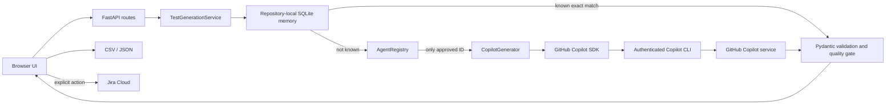

# Architecture

## Runtime policy

GitHub Copilot is the sole approved AI runtime. `AgentRegistry` fails closed when an adapter
declares any other runtime ID. The agent contract separates application logic from the SDK,
improves testability, and makes capabilities explicit; it does not enable runtime selection.

## Functional agents

The solution uses a hybrid agent architecture. Repository-owned `.github/agents/*.agent.md` files
are the readable behavior and responsibility layer. `app/agent_instructions.py` loads only an
allowlisted set of those files into Copilot sessions. Python remains the governed execution layer,
so Markdown instructions cannot bypass typed schemas, quality gates, storage rules, or security
boundaries.

Team or project requirements are layered from `.github/agent-profiles/<AGENT_PROFILE>/profile.md`.
Optional per-agent Markdown in the same directory adds domain-specific terminology, test risks,
framework conventions, and output rules. Profile names are path-safe, the profile must exist, and
base policies are always loaded first. An optional profile `knowledge/` directory supplies
version-controlled domain baselines to the same Copilot session. The active Auto Finance profile
uses a normalized Quotation Service BRD v1.0 baseline; it is grounding context rather than model
fine-tuning.

The application is coordinated as fourteen explicit roles under `app/agents/`. SpecForge routes an
explicit `generation_target`, or infers intent from terms such as Playwright, automation,
manual test, exploratory, and usability. Ambiguous or neutral requests fan out to both specialists.

1. `InputAgent` normalizes pasted text or extracts requirements from supported documents.
2. `BusinessRulesAgent` grounds generation in explicit `BR-*` constraints and traceability.
3. `KnowledgeAgent` checks for an exact validated match before any Copilot request.
4. `TestCaseGeneratorAgent` is the SpecForge router that resolves the requested action.
5. `ManualTestCaseGeneratorAgent` creates human-led test scenarios.
6. `AutomationTestCaseGeneratorAgent` receives the automation route segregated by SpecForge and
   creates only repeatable deterministic UI, API, integration, or BDD automation scenarios. Its
   generation request always asks for executable Gherkin so scenarios can be packaged as a
   framework-compatible `.feature` file; parameterized outlines retain complete Examples tables.
7. `TestDataAgent` fills missing case-aligned values with privacy-safe synthetic data.
8. `TestCaseValidatorAgent` independently checks coverage, traceability, duplicates, clarity,
   expected results, business-rule alignment, and specialist execution mode. Manual output is
   gated immediately after generation; both manual and automation output receive one
   findings-driven revision and cannot proceed if the revised suite still fails.
9. `ContextConverterAgent` accepts only a passing validation report and produces Xray-oriented
   CSV, Excel, JSON, or Gherkin `.feature` interchange files.
10. `OutputAgent` stores converted artifacts and exposes relevant approved examples as a bounded
   organizational knowledge source. This is retrieval-augmented generation, not model training;
   current business requirements always take precedence over retrieved examples. Feature files
   are retained as artifacts, while each Scenario or Scenario Outline is also stored as an
   individually indexed record with its mode, Gherkin, and requirement mappings.
11. `TestStorageAgent` retrieves and stores validated suites in repository-local SQLite memory.
12. `ExecutionAgent` validates results supplied by an approved manual or automation run.
13. `BugReporterAgent` creates review-required defect drafts for failed tests.
14. `MetricsAgent` calculates coverage, execution, and defect measures from reviewed evidence.

`MultiAgentTestPipeline` owns their execution order. A newly generated suite is stored only
when validation has no error findings. Retrieved suites are validated again before return.
Agent metadata is discoverable through `GET /api/agents`.
Execution remains controlled: the application does not run arbitrary commands, and defect drafts
are not published automatically.

## Boundaries

- `app/main.py`: HTTP transport only.
- `app/services/`: application use cases and orchestration.
- `app/agents/__init__.py`: stable agent contracts, discoverable metadata, and organization
  runtime allowlist policy.
- `app/services/__init__.py`: generation use cases and the multi-agent pipeline; legacy service
  import paths remain available for compatibility.
- `app/services/document_ingestion.py`: bounded document extraction and input-agent normalization.
- `app/observability.py`: safe logging, request correlation, HTTP protections, and cancellation.
- `app/agents/test_case_generator_agent.py`: specialist generation and SpecForge routing.
- `app/generator.py`: GitHub Copilot SDK adapter, prompts, parsing, and quality gate.
- `app/memory.py`: normalized fingerprinting and repository-local SQLite suite retrieval.
- `app/models.py`: validated domain and API data contracts.
- `app/jira.py` and `app/exporter.py`: outbound integrations.
- `app/dependencies.py`: composition root.

The Copilot session disables its opaque model memory, tools, MCP servers, skills, repository
instruction discovery, file hooks, host Git operations, and session storage. The application
instead owns an auditable exact-match SQLite memory. Jira publication remains a separate,
explicit user operation.

## Request flow

1. FastAPI validates the request with Pydantic.
2. `TestGenerationService` fingerprints the requirement, context, format, and generation target.
3. A known exact match returns immediately from organizational memory without calling Copilot.
4. Otherwise, the approved registry supplies the test-design agent and `CopilotGenerator` opens
   a restricted authenticated session.
5. SpecForge calls the selected specialist, or both specialists concurrently, and combines their
   structured suites.
6. The quality gate validates automation/manual feasibility, deduplicates, caps, and formats the
   result.
7. The suite is stored in organizational memory and rendered as manual test steps or SpecFlow Gherkin.
