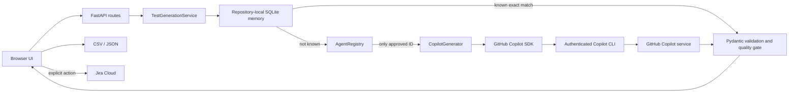

# Architecture

## Runtime policy

GitHub Copilot is the sole approved AI runtime. `AgentRegistry` fails closed when an adapter
declares any other runtime ID. The agent contract separates application logic from the SDK,
improves testability, and makes capabilities explicit; it does not enable runtime selection.

## Functional agents

The application is coordinated as four explicit roles under `app/agents/`:

1. `InputAgent` normalizes pasted text or extracts requirements from supported documents.
2. `TestCaseGeneratorAgent` uses the approved GitHub Copilot adapter to create both manual and
   automation scenarios.
3. `TestCaseValidatorAgent` independently checks coverage, traceability, duplicates, clarity,
   and expected results.
4. `TestStorageAgent` retrieves and stores validated suites in repository-local SQLite memory.

`MultiAgentTestPipeline` owns their execution order. A newly generated suite is stored only
when validation has no error findings. Retrieved suites are validated again before return.
Agent metadata is discoverable through `GET /api/agents`.

## Boundaries

- `app/main.py`: HTTP transport only.
- `app/services/`: application use cases and orchestration.
- `app/agents/contracts.py`: stable agent capability contract.
- `app/agents/registry.py`: organization runtime allowlist and policy enforcement.
- `app/generator.py`: GitHub Copilot SDK adapter, prompts, parsing, and quality gate.
- `app/memory.py`: normalized fingerprinting and repository-local SQLite suite retrieval.
- `app/models.py`: validated domain and API data contracts.
- `app/jira.py` and `app/exporter.py`: outbound integrations.
- `app/dependencies.py`: composition root.

The Copilot session disables its opaque model memory, tools, MCP servers, skills, repository
instruction discovery, file hooks, host Git operations, and session storage. The application
instead owns an auditable exact-match SQLite memory. Jira publication remains a separate,
explicit user operation.

## Request flow

1. FastAPI validates the request with Pydantic.
2. `TestGenerationService` fingerprints the normalized requirement, context, and format.
3. A known exact match returns immediately from organizational memory without calling Copilot.
4. Otherwise, the approved registry supplies the test-design agent and `CopilotGenerator` opens
   a restricted authenticated session.
5. Copilot returns structured JSON containing 4–5 scenarios with at least two automation and two
   manual cases.
6. The quality gate validates automation/manual feasibility, deduplicates, caps, and formats the
   result.
7. The suite is stored in organizational memory and rendered as manual test steps or SpecFlow Gherkin.
