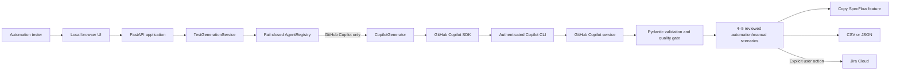

# TestPilot AI — Client Demonstration Guide

## 1. Demonstration purpose

TestPilot AI is a proof-of-concept quality-engineering assistant that converts product
requirements into concise, reviewable test scenarios. It uses the client's organization-enabled
GitHub Copilot entitlement as its only AI runtime.

The demonstration shows how an automation tester can:

- turn a user story or acceptance criteria into 4–5 high-level scenarios, including at least two
  automation and two manual cases;
- choose manual test steps or SpecFlow-compatible BDD;
- generate `Scenario Outline` and `Examples` tables for data-driven coverage;
- copy individual scenarios or download an entire `.feature` file;
- export results as CSV or JSON; and
- explicitly publish selected scenarios to Jira when Jira is configured.

The generated scenarios are drafts for human review. They support test design but do not replace
quality-engineering judgment, executable automation code, or evidence from test execution.

## 2. Recommended audience

- Quality engineering and test automation teams
- Product owners and business analysts
- Engineering managers and architects
- DevOps and platform engineering teams
- Security, risk, and AI governance stakeholders

## 3. Suggested 10-minute agenda

| Time | Topic | Outcome |
|---|---|---|
| 0:00–1:00 | Business problem | Establish the test-design bottleneck |
| 1:00–2:00 | Architecture and governance | Explain the Copilot-only runtime |
| 2:00–4:00 | Normal scenario generation | Show concise, structured test coverage |
| 4:00–7:00 | SpecFlow BDD generation | Show copy-ready scenarios and outlines |
| 7:00–8:00 | Export and Jira workflow | Demonstrate controlled downstream use |
| 8:00–9:00 | Security and limitations | Set responsible expectations |
| 9:00–10:00 | Questions and next steps | Agree potential pilot scope |

## 4. Presenter preparation

Complete these checks before the client session:

- [ ] Confirm the organization has enabled GitHub Copilot CLI.
- [ ] Authenticate with the approved account using `copilot login`.
- [ ] Install dependencies with `pip install -e '.[dev]'`.
- [ ] Run `python -m pytest -q`; all tests should pass.
- [ ] Start the application with `uvicorn app.main:app --host 127.0.0.1 --port 8000`.
- [ ] Confirm `http://127.0.0.1:8000/api/health` returns `ok: true` and
      `ai_provider: github-copilot`.
- [ ] Open `http://127.0.0.1:8000` and perform one rehearsal generation.
- [ ] Prepare a backup screenshot or exported JSON in case the hosted service is unavailable.
- [ ] Use synthetic demonstration requirements and data only.
- [ ] If demonstrating Jira, use a non-production project and verify attachment permissions.

Do not display `.env`, credentials, Copilot logs, Jira tokens, or real customer requirements.

## 5. Executive opening

Suggested presenter narrative:

> Quality engineers often spend significant time translating requirements into consistent test
> scenarios before automation begins. TestPilot AI accelerates that first design step. It uses
> our approved GitHub Copilot service to produce a small, risk-focused suite that remains under
> human control. Automation testers can copy SpecFlow-ready Gherkin directly into feature files,
> while manual test cases can be exported or selectively attached to Jira.

Key value propositions:

- Faster movement from requirements to an initial test design
- More consistent scenario structure and expected results
- Practical support for SpecFlow automation workflows
- Explicit human review before export or Jira publication
- One organization-approved AI runtime with no fallback provider

## 6. Architecture to present



Architecture talking points:

- The FastAPI application and browser run locally for this POC.
- GitHub Copilot is the only active and permitted AI runtime.
- The registry rejects any runtime whose ID is not `github-copilot`.
- Copilot tools, MCP servers, skills, memory, file hooks, Git operations, and workspace mutation
  are disabled during test generation.
- Model output is untrusted until it passes the Pydantic schema and quality gate.
- Jira publishing is separate from generation and requires an explicit user action.

## 7. Demonstration 1 — Manual test scenarios

Select **Manual test** and paste this synthetic story:

```text
As a registered customer, I want to reset my password using a time-limited email link so that I
can regain access securely.

Acceptance criteria:
1. The reset link expires after 15 minutes.
2. A used link cannot be reused.
3. The new password must satisfy the password policy.
4. A successful reset invalidates existing sessions.
```

Optional additional context:

```text
Supported roles: registered customer. Password policy: at least 12 characters, including upper
case, lower case, number, and special character. Use synthetic accounts only.
```

Click **Generate Test Scenarios**.

Explain the result:

- Copilot returns 4–5 high-level scenarios, including automation and manual coverage, rather than
  an exhaustive suite.
- Each scenario has a category, priority, objective, actions, and observable expected results.
- Each scenario is segregated as `automation` or `manual` with a case-specific feasibility
  rationale.
- Duplicate title/objective combinations are removed.
- No more than five scenarios are published by the generation quality gate.
- The tester reviews the result before copying, exporting, or publishing it.

## 8. Demonstration 2 — SpecFlow BDD

Select **BDD / Gherkin** and reuse the password-reset story.

Point out the two supported forms:

```gherkin
Scenario: Reset a password with a valid link
  Given a registered customer has a valid password reset link
  When the customer submits a password that satisfies the password policy
  Then the password is changed successfully
  And the customer's existing sessions are invalidated
```

For repeated inputs or outcomes, the generated result should use a data-driven outline:

```gherkin
Scenario Outline: Reject an invalid password reset attempt
  Given a registered customer has a reset link in the <link_state> state
  When the customer attempts to set the password to <new_password>
  Then the reset is rejected with <expected_message>

Examples:
  | link_state | new_password | expected_message       |
  | expired    | Valid#Pass12 | Reset link has expired |
  | used       | Valid#Pass12 | Reset link was used    |
  | valid      | short        | Password is invalid    |
```

Use **Copy scenario** to copy one block. Use **↓ .feature** to download all scenarios with a
generated `Feature:` header as a SpecFlow `.feature` file, after which the automation team
implements or reuses the corresponding
step definitions.

Generated Gherkin must still be reviewed against the team's vocabulary, binding conventions,
tags, hooks, and automation architecture.

## 9. Demonstration 3 — Export and Jira

Show the available controlled actions:

- **CSV** downloads the complete generated suite for review or test-management import.
- **JSON** downloads the structured API representation.
- Test-case checkboxes determine which cases are eligible for Jira publication.
- **Attach to Jira** publishes only the selected cases and is never triggered automatically.

If Jira is not configured, describe the workflow rather than attempting publication. Jira needs
`JIRA_BASE_URL`, `JIRA_EMAIL`, and `JIRA_API_TOKEN`, and the account requires Browse Projects,
Add Attachments, and Add Comments permissions.

## 10. Security and governance narrative

| Control | POC implementation |
|---|---|
| Approved AI runtime | GitHub Copilot only |
| Runtime enforcement | Fail-closed registry checks `github-copilot` |
| Provider fallback | None |
| Model output | Validated using typed Pydantic contracts |
| Test data | Prompt requires synthetic data only |
| Agent tools | Disabled during generation |
| Workspace mutation | Disabled during generation |
| Jira publication | Explicit, user-initiated action |
| Automated tests | External AI and Jira calls are mocked |
| Secrets | Environment configuration; excluded from source control |

Client-specific security, privacy, retention, residency, and acceptable-use requirements must be
validated against the client's GitHub organization policies before production deployment.

## 11. POC scope and limitations

Be explicit about the current boundaries:

- The output is limited to 4–5 high-level scenarios to reduce latency and premium-request usage.
- AI-generated cases are suggestions, not proof of complete coverage.
- The application does not execute tests or generate SpecFlow step-definition code.
- Generated Gherkin may require alignment with an existing domain language and automation stack.
- The POC does not provide user management, role-based access control, audit storage, or a
  persistent test-suite database.
- The health endpoint reports configuration but does not consume a premium request to test
  upstream Copilot availability.
- Copilot availability, models, usage limits, and billing follow the authenticated account and
  organization policy.
- Jira support targets Jira Cloud attachment and comment APIs, not Xray, Zephyr, or Jira Data
  Center test-management APIs.

## 12. Frequently asked questions

### Does the application send requests to OpenAI, Claude, or another provider?

No. GitHub Copilot is the only implemented and approved AI runtime. There is no fallback provider
or runtime selector.

### Does it use our GitHub Copilot organization entitlement?

Yes. The Copilot SDK uses the authenticated Copilot CLI identity or an approved
`COPILOT_GITHUB_TOKEN`. The organization's Copilot CLI policy must permit access.

### Can generated BDD be used immediately?

It can be pasted into a SpecFlow feature file as a starting point. The automation team must
review the language and ensure matching step definitions exist or are implemented.

### Why does it generate only five scenarios?

The POC prioritizes quick, high-value suggestions and predictable premium-request usage. A
production design can introduce configurable, governed coverage strategies after measuring
quality, latency, and cost.

### Can it publish to Jira automatically?

No. Publishing is intentionally explicit. The tester selects scenarios, enters an issue key,
and initiates the attachment.

### Is customer data stored?

The application does not implement a test-suite database. Operational logging and upstream
Copilot data handling still need to be reviewed against the client's deployment configuration
and GitHub agreements.

## 13. Recommended next steps after the demonstration

1. Select two or three representative, non-sensitive client workflows.
2. Define a measurable pilot baseline: design time, scenario usefulness, edit rate, and coverage
   defects found during review.
3. Agree the approved GitHub organization, Copilot policy, models, and usage budget.
4. Review privacy, security, logging, retention, and deployment requirements.
5. Align generated Gherkin with the client's SpecFlow conventions and shared step library.
6. Decide whether Jira attachment is sufficient or a governed test-management integration is
   required.
7. Run a time-boxed pilot with automation testers and capture structured feedback.

## 14. Presenter close

Suggested closing statement:

> This POC demonstrates a governed path from requirements to an initial automation-ready test
> design using the organization's existing GitHub Copilot capability. The value is acceleration,
> consistency, and easier collaboration—not autonomous quality assurance. A measured pilot will
> show where the generated scenarios save time and where client-specific standards should shape
> the next iteration.
